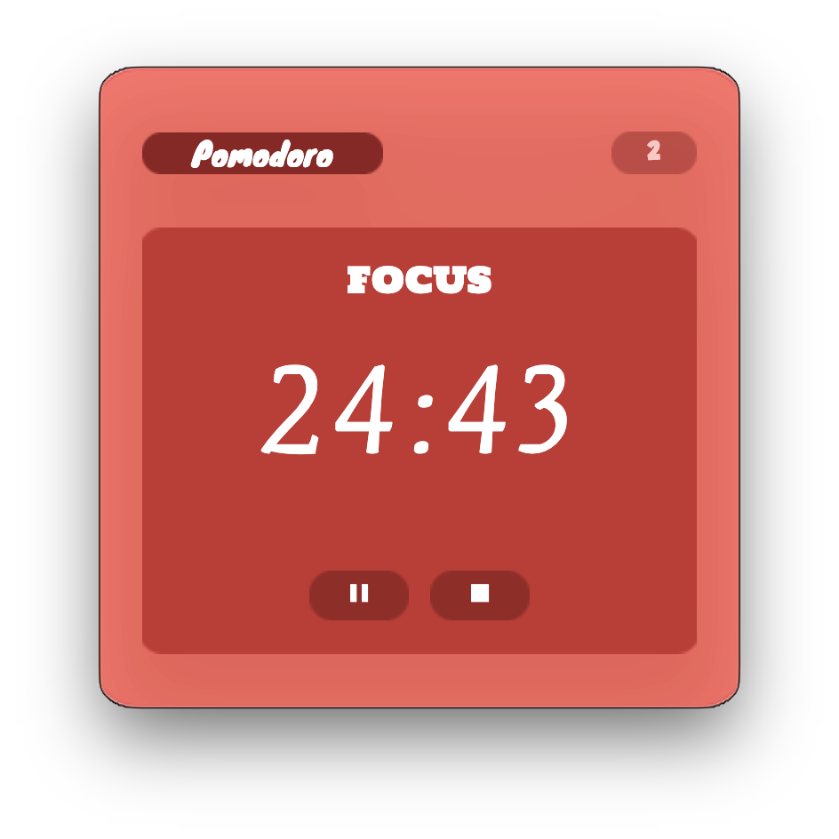

# Mini Pomodoro Timer

A lightweight, visually appealing **Pomodoro timer** built with **HTML, CSS, and JavaScript**, featuring customizable sessions, focus/break timers, sound alerts, animations, and a reset button.

---

## Features

- **Configurable Focus and Break Times** – Easily adjustable in `script.js`.
- **Multiple Sessions** – Select the number of Pomodoro sessions using the dropdown.
- **Start/Pause Timer** – Play button toggles between start and pause.
- **Reset Timer** – Reset the timer and sessions anytime.
- **Phase Switching** – Automatically switches between **FOCUS** and **BREAK** phases.
- **Animations** – Timer text animates when phase changes.
- **Sound Alerts** – Plays a beep sound at the end of each session.
- **Edge Case Handling** – Prevents negative timers and handles session completion gracefully.
- **Draggable App** – Works in Electron with drag support while keeping buttons clickable.

---

## Screenshots



---

## Installation

1. **Install Node.js** (if not already installed):  
   [Download Node.js](https://nodejs.org/)

2. **Install Electron globally** (optional, or locally in project):

```bash
npm install -g electron
```

3. Clone or download this repository.
4. Install project dependencies (if you want to manage Electron locally):

```bash
npm init -y
npm install electron --save-dev
```

5. Place the following assets inside an `assets` folder in the root directory:
   - `bg.png` – Main background for the app
   - `titlebg.png` – Background for the heading
   - `timerbg.png` – Background for the timer panel
   - `playbg.png` – Button background
   - `beep.mp3` – Sound alert for session end

6. Open `index.html` in your browser or run inside **Electron** for draggable window support.

---

## Usage

1. **Select the number of sessions** from the dropdown.
2. Click the **Play ▶ button** to start the timer.
3. The timer will automatically switch between **FOCUS** and **BREAK**.
4. Click **Pause ⏸** to pause the timer.
5. Click **Reset ⏹** to restart the current session timer.
6. An **alert** and beep sound will play when all sessions are completed.

---

## Configuration

- Change default **focus** and **break** durations in `script.js`:

```js
const TIMES = {
  focus: 25 * 60, // Focus duration in seconds
  break: 5 * 60, // Break duration in seconds
};
```

=======
